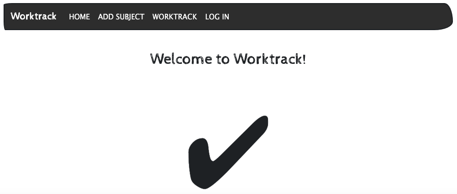
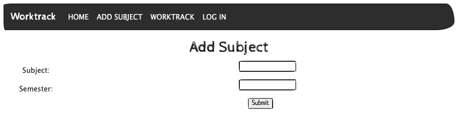
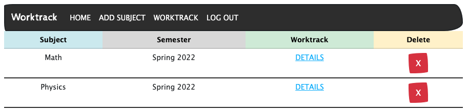
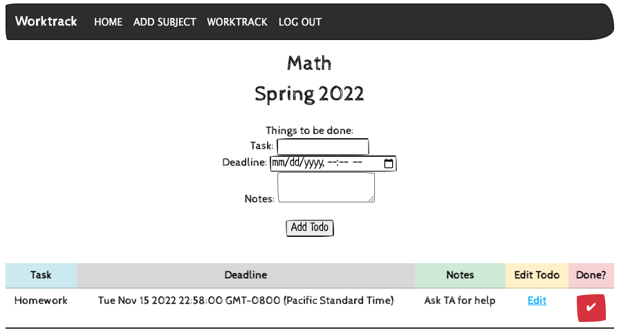
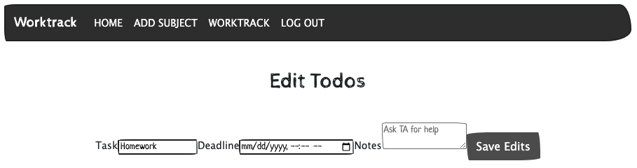

# Worktrack

## Background
Application: Worktrack
Worktrack is an application for students to organize their todo list by subject.

## Screenshot of Game

### Technologies Used
-JavaScript

-HTML

-CSS

-NodeJS & ExpressJS Framework

-MongoDB & MongooseJS ODM

-OAuth

#### Application
Link to the application: [Worktrack](TBD)

**Instructions:**
Add your class subjects to Worktrack and start adding things that need to be done! You can delete and edit your todo list as you complete each task.

#### Next Steps
I would like to add more CSS styling to the application and be more thoughtful on my text sizes and alignment. I would also like to add more pictures. Most importantly, I want this app to be be more encompassing of a student's school life and so adding a few more functionalities and data entities would be ideal.
